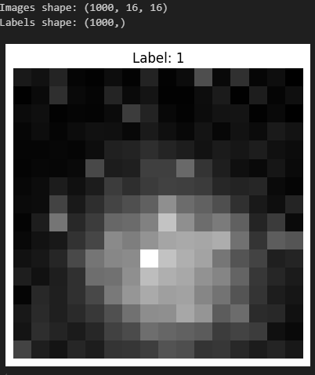
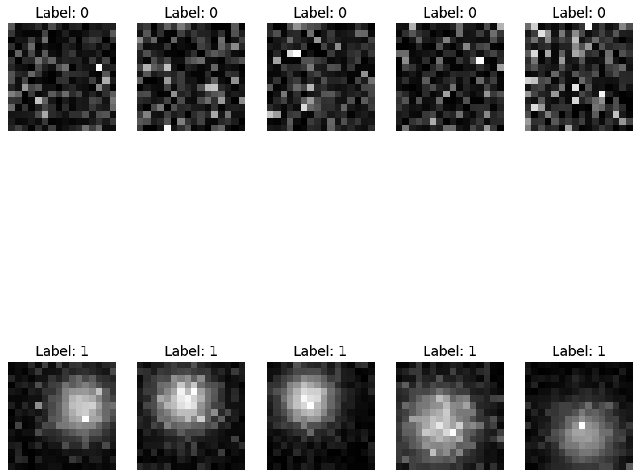
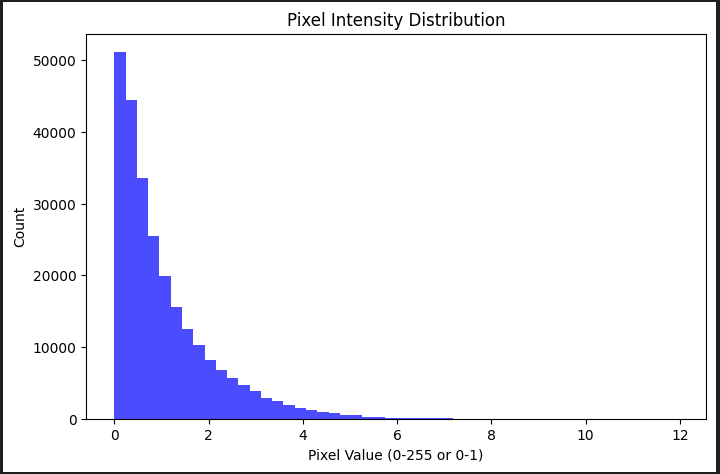
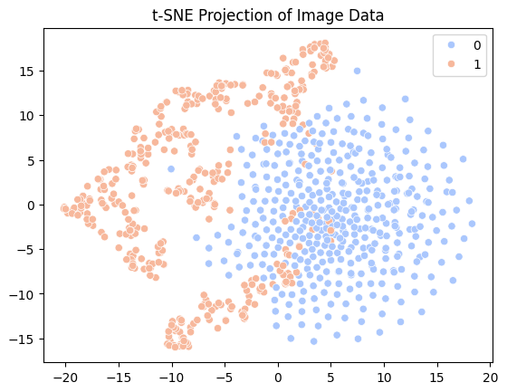
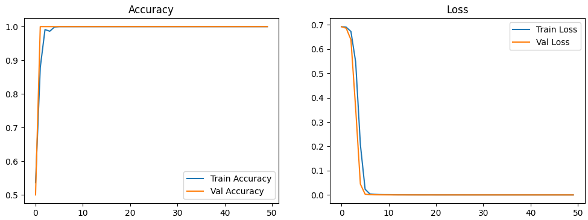
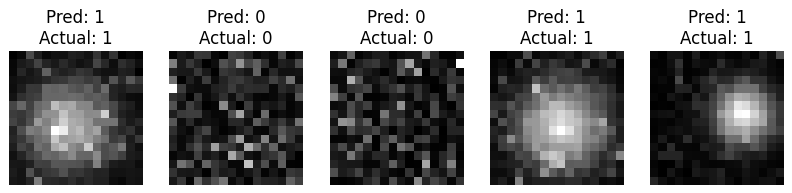
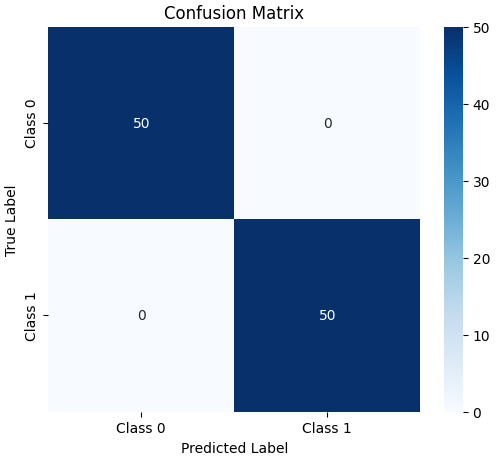

# Analysis of a Scientific Dataset via Machine Learning

## Installation

Install the required dependencies from `requirements.txt` to run the Jupyter notebooks:

```bash
pip install numpy matplotlib keras tensorflow seaborn
```

## Project Structure

The project contains three notebooks:

- **analysis.ipynb**: Contains detailed analysis of the dataset
- **model_eval.ipynb**: Contains evaluation and details of the given model in the task
- **improved_model.ipynb**: Improved model built to enhance performance
- **data**: Contains two data files - images.npy and labels.npy
- **model**: Contains the model given to evaluate for the task
- **images**: Contains the images of analysis plots

## About the Project

### Data Analysis

The dataset analysis revealed several key insights:

- The dataset consists of 1,000 grayscale images, each of size 16×16
- 500 images are labeled as 0, while the remaining 500 are labeled as 1
- Images labeled as 0 appeared as random noise, whereas those labeled as 1 contained a bright spot
- This pattern suggests the images likely originate from a scientific experiment or study

#### Sample Image


#### Dataset Images


#### Pixel Distribution
- A histogram visualization of pixel intensity values across the dataset was created to understand the pixel density distribution



### Model Details and Evaluation

The provided model was loaded and analyzed with the following findings:

- **Architecture**:
  - Input Layer of shape (None, 16, 16), matching the dataset dimensions
  - A TFSMLayer for inference
  - Total Parameters: 0, indicating the model might not have trainable parameters and likely performs a simple transformation or computation

- **Performance**:
  - The model's output suggests it was likely trained for regression rather than classification
  - Classification accuracy is low, implying that a simple threshold-based conversion may not be effective

### Improved Model

A dedicated binary classification model, CNN was built to enhance performance:

#### Exploratory Analysis
- t-Distributed Stochastic Neighbor Embedding (t-SNE) projection was performed to visualize high-dimensional data in 2D space, preserving local relationships between data points



#### Model Architecture
A Convolutional Neural Network (CNN) was designed with:
- **Convolutional Layers**: Extract hierarchical features from the images
- **MaxPooling Layers**: Reduce spatial dimensions while retaining important information
- **Fully Connected Layers**: Learn complex patterns and make predictions
- **Dropout Layer**: Prevents overfitting by randomly disabling neurons during training
- **Sigmoid Activation**: Outputs a probability score for binary classification

#### Model Compilation and Training
- Adam optimizer with a learning rate of 1e-4 for efficient gradient updates
- Binary cross-entropy loss function for the binary classification task
- Accuracy tracked as the primary performance metric
- Early stopping implemented to halt training if validation loss didn't improve for 5 consecutive epochs
- Model trained for a maximum of 50 epochs with a batch size of 32

#### Training Evaluation
- Plotted training and validation accuracy over epochs
- Plotted training and validation loss over epochs



#### Prediction Visualization
Implemented a `plot_predictions()` function that:
- Randomly selects five samples from the test set
- Displays:
  - The original grayscale image
  - The predicted label
  - The actual ground truth label



#### Performance Analysis
- Used a confusion matrix to gain deeper insights into the model's classification performance
- This analysis helps understand how well the model distinguishes between:
  - Class 0 (random noise)
  - Class 1 (bright spot)


